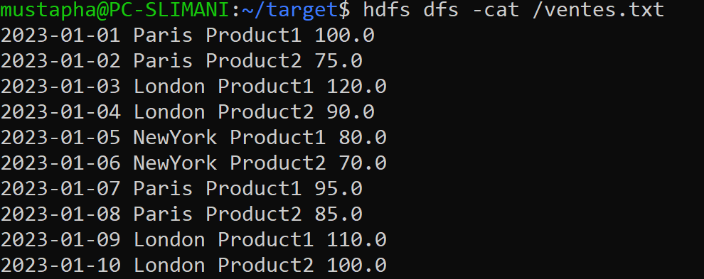
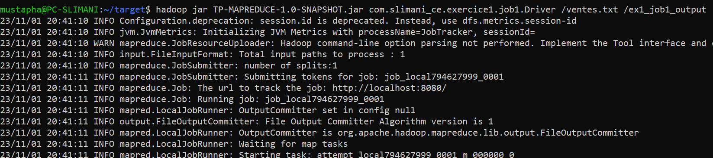
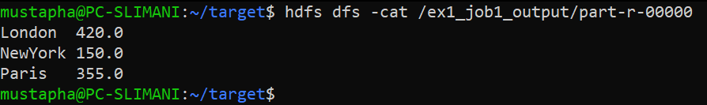
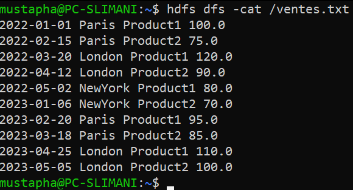
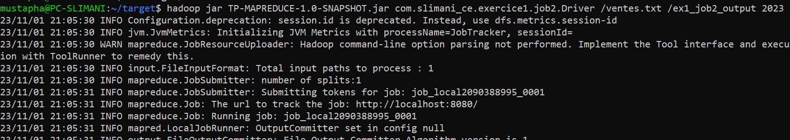
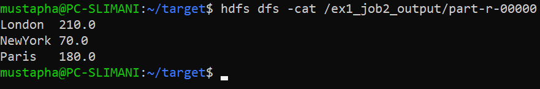
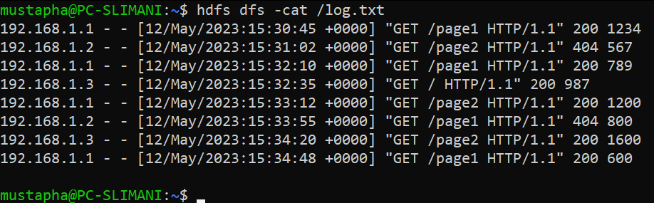
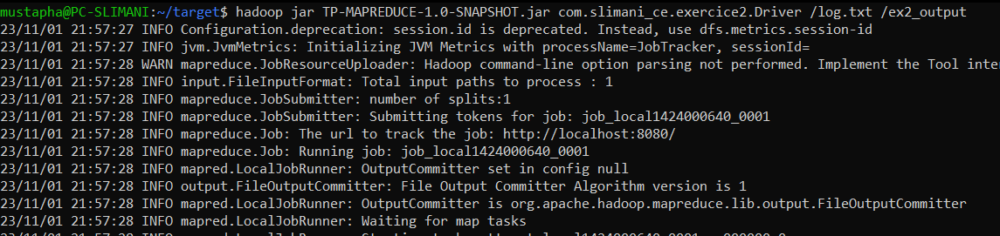
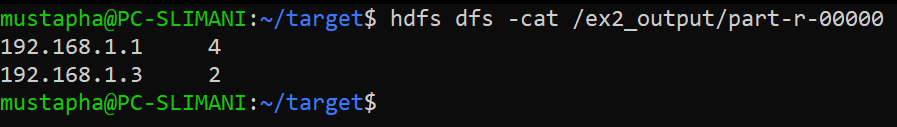

# TP2 : Hadoop MapReduce

## Introduction

Ce project décrit deux exercices pratiques utilisant Hadoop MapReduce pour traiter des données structurées et non structurées. Les exercices couvrent la manipulation de données de vente et l'analyse de fichiers journaux Web.

## Structure du projet

```
   src
    ├───main
    │   ├───java
    │   │   └───com
    │   │       └───slimani_ce
    │   │           ├───exercice1
    │   │           │   ├───job1
    │   │           │   │       Driver.java
    │   │           │   │       JobMapper.java
    │   │           │   │       JobReducer.java
    │   │           │   │
    │   │           │   └───job2
    │   │           │           Driver.java
    │   │           │           JobMapper.java
    │   │           │           JobReducer.java
    │   │           │
    │   │           ├───exercice2
    │   │           │       Driver.java
    │   │           │       JobMapper.java
    │   │           │       JobReducer.java
    │   │           │
    │   │           └───word_counting
    │   │                   WordCountDriver.java
    │   │                   WordCountMapper.java
    │   │                   WordCountReducer.java
    │   │
    │   └───resources
    └───test
        └───java
```

## Exercice 1 : Traitement de données de vente

### Objectif

Développer un job Hadoop MapReduce pour calculer le total des ventes par ville à partir d'un fichier texte (ventes.txt) contenant les ventes d'une entreprise dans différentes villes. La structure du fichier ventes.txt est la suivante :

```
date ville produit prix
```

### Travail à faire

1. Développer un job MapReduce pour calculer le total des ventes par ville.
2. Développer un deuxième job pour calculer le prix total des ventes des produits par ville pour une année donnée.

### La tâche 1

1. Code source du Driver

```java
public class Driver {
    public static void main(String[] args) throws Exception {
        Configuration conf = new Configuration();
        Job job = Job.getInstance(conf);

        job.setJarByClass(Driver.class);
        job.setMapperClass(JobMapper.class);
        job.setReducerClass(JobReducer.class);

        job.setOutputKeyClass(Text.class);
        job.setOutputValueClass(DoubleWritable.class);

        job.setInputFormatClass(TextInputFormat.class);

        FileInputFormat.addInputPath(job, new Path(args[0]));
        FileOutputFormat.setOutputPath(job, new Path(args[1]));

        job.waitForCompletion(true);
    }
}

```

2. Code source du Mapper

```java
public class JobMapper extends Mapper<LongWritable, Text,Text,DoubleWritable> {
    @Override
    protected void map(LongWritable key, Text value, Mapper<LongWritable, Text, Text, DoubleWritable>.Context context) throws IOException, InterruptedException {
        String[] tokens = value.toString().split(" ");
        if (tokens.length == 4) {
            String city = tokens[1];
            double price = Double.parseDouble(tokens[3]);
            context.write(new Text(city), new DoubleWritable(price));
        }
    }
}
```

3. Code source du Reducer

```java
public class JobReducer extends Reducer<Text, DoubleWritable,Text,DoubleWritable> {
    @Override
    protected void reduce(Text key, Iterable<DoubleWritable> values, Reducer<Text, DoubleWritable, Text, DoubleWritable>.Context context) throws IOException, InterruptedException {
        double totalSales = 0.0;
        for (DoubleWritable value : values) {
            totalSales += value.get();
        }
        context.write(key, new DoubleWritable(totalSales));
    }
}
```

4. Test avec une list des ventes



5. Execution

```
hadoop jar TP-MAPREDUCE-1.0-SNAPSHOT.jar com.slimani_ce.exercice1.job1.Driver /ventes.txt /ex1_job1_output
```



6. Résultats



### La tâche 2

1. Code source du Driver

```java
public class Driver {
   public static void main(String[] args) throws Exception {
      Configuration conf = new Configuration();
      Job job = Job.getInstance(conf);

      job.setJarByClass(Driver.class);
      job.setMapperClass(JobMapper.class);
      job.setReducerClass(JobReducer.class);

      job.setOutputKeyClass(Text.class);
      job.setOutputValueClass(DoubleWritable.class);

      job.setInputFormatClass(TextInputFormat.class);

      FileInputFormat.addInputPath(job, new Path(args[0]));
      FileOutputFormat.setOutputPath(job, new Path(args[1]));

      job.waitForCompletion(true);
   }
}
```

2. Code source du Mapper

```java
public class JobMapper extends Mapper<LongWritable, Text, Text, DoubleWritable> {
   @Override
   protected void map(LongWritable key, Text value, Mapper<LongWritable, Text, Text, DoubleWritable>.Context context) throws IOException, InterruptedException {
      String[] tokens = value.toString().split(" ");
      if (tokens.length == 4) {
         String city = tokens[1];
         double price = Double.parseDouble(tokens[3]);
         context.write(new Text(city), new DoubleWritable(price));
      }
   }
}
```

3. Code source du Reducer

```java
public class JobReducer extends Reducer<Text, DoubleWritable, Text, DoubleWritable> {
   @Override
   protected void reduce(Text key, Iterable<DoubleWritable> values, Reducer<Text, DoubleWritable, Text, DoubleWritable>.Context context) throws IOException, InterruptedException {
      double totalSales = 0.0;
      for (DoubleWritable value : values) {
         totalSales += value.get();
      }
      context.write(key, new DoubleWritable(totalSales));
   }
}
```

4. Test avec une list des ventes



5. Execution (Avec l'année 2023 comme paramètre)

```
hadoop jar TP-MAPREDUCE-1.0-SNAPSHOT.jar com.slimani_ce.exercice1.job2.Driver /ventes.txt /ex1_job2_output 2023
```



6. Résultats




## Exercice 2 : Analyse des fichiers journaux Web

### Objectif
Analyser un grand ensemble de fichiers journaux (logs) Web générés par un serveur. Chaque ligne du fichier journal contient des informations sur les requêtes HTTP, y compris l'adresse IP du client, la date, le chemin d'accès demandé, le code de réponse HTTP, etc.

### Travail à faire
Utiliser Hadoop MapReduce pour calculer le nombre total de requêtes et le nombre de requêtes réussies (code de réponse HTTP 200) par adresse IP.

1. Source code du Driver
```java
public class Driver {
    public static void main(String[] args) throws Exception {
        Configuration conf = new Configuration();
        Job job = Job.getInstance(conf);
        job.setJarByClass(Driver.class);
        job.setMapperClass(JobMapper.class);
        job.setReducerClass(JobReducer.class);
        job.setOutputKeyClass(Text.class);
        job.setOutputValueClass(IntWritable.class);
        job.setInputFormatClass(TextInputFormat.class);
        FileInputFormat.addInputPath(job, new Path(args[0]));
        FileOutputFormat.setOutputPath(job, new Path(args[1]));
        job.waitForCompletion(true);
    }
}
```

2. Source code du Mapper
```java
public class JobMapper extends Mapper<LongWritable, Text, Text, IntWritable> {
    @Override
    protected void map(LongWritable key, Text value, Context context) throws IOException, InterruptedException {
        String[] tokens = value.toString().split(" ");
        if (tokens.length >= 8) {
            String ipAddress = tokens[0];
            String httpStatus = tokens[8];
            if (httpStatus.equals("200")) {
                context.write(new Text(ipAddress), new IntWritable(1));
            }
        }
    }
}
```

3. Source code du Reducer
```java
public class JobReducer extends Reducer<Text, IntWritable, Text, IntWritable> {
    @Override
    protected void reduce(Text key, Iterable<IntWritable> values, Context context) throws IOException, InterruptedException {
        int totalRequests = 0;
        for (IntWritable value : values) {
            totalRequests += value.get();
        }
        context.write(key, new IntWritable(totalRequests));
    }
}
```

4. Test avec un fichier log



5. Execution 

```
hadoop jar TP-MAPREDUCE-1.0-SNAPSHOT.jar com.slimani_ce.exercice2.Driver /log.txt /ex2_output
```


6. Résultats (Le nombre de requêtes réussies)


